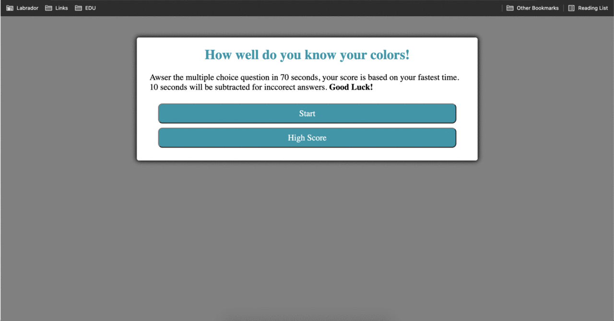

# 04-Web-APIs-Code-Quiz

Create a multiple choice question quiz that scored based on time. The quiz should use html structure, css styles, and javaScript. The quiz should subtract time for inccorect answers and add for correct answers. The quiz should store the scores in local storage for future recall. 

## GitHub Links 
Live Page [Link](https://jeffcela.github.io/04-Web-APIs-Code-Quiz/)  
Project Repository [Link](https://github.com/jeffcela/04-Web-APIs-Code-Quiz)

## How its made!
Make sure to clone or download the entire repository as this document uses **HTML, CSS, GIFs and JavaScript files**. Adding additional comments with the HTML or CSS code will allow for the continue ease of use when updating for future use. 

**What is included:**
* index.html
* gitignore (Used to prevent items from being added to the repo)
* assets folder
   * css folder
      * style.css
   * js folder
      * script.js 
* README.md

*Please make sure that you are adding any additional assets as needed*

## This is how the quiz will function!
   

# Credit 
_This homework assignment was completed in VS Code and Terminal by [Jeff Cela](https://www.linkedin.com/in/jeffcela/) on the day of 07/25/2021_ 
© 2021 Trilogy Education Services, LLC, a 2U, Inc. brand. Confidential and Proprietary. All Rights Reserved. 
_HTML._ W3Schools Online Web Tutorials. (1999). [https://www.w3schools.com/](https://www.w3schools.com/). 
_Learning Javascript is rough, use the best website to learn JavaScript, JavaScript.com!_ JavaScript.com. (n.d.). https://www.javascript.com/resources.  
Animated GIF Maker - Make GIFs from Images or Videos. (2012). https://gifmaker.me/. 
